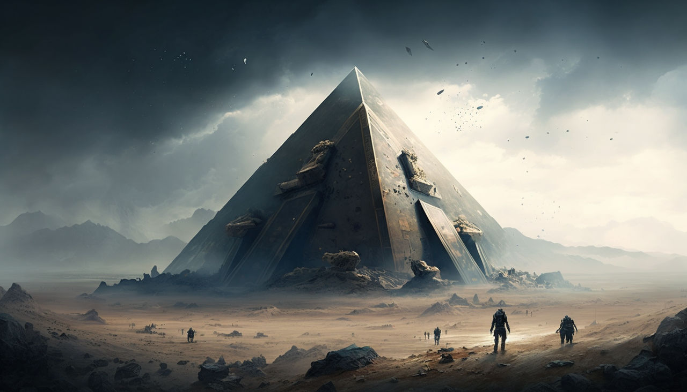
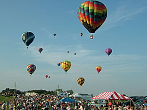
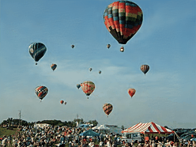
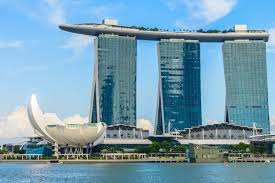
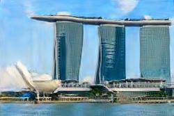
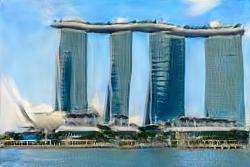
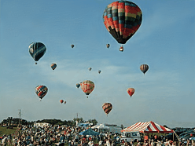

# Solo-Synth-GAN (<b><i>Zero Shot</i></b> Image-2-Video)


      


   


**[Documentation](https://github.com/PrateekJannu/Solo-Synth-GAN-v1.0)** | **[Paper(Updated Soon)]()** | **[Code of Conduct](https://github.com/PrateekJannu/Solo-Synth-GAN-v1.0?tab=coc-ov-file)** | **[Developer's Guide](https://github.com/PrateekJannu/Solo-Synth-GAN-v1.0/blob/main/CONTRIBUTING.md)**



# Solo-Synth GAN: Train only on one image

 | 

This is the open-source repository for the project Solo-Synth GAN which is one of the latest zero shot generative adversarial network techniques for image-2-video while training it only on a <b><i>SINGLE IMAGE</i></b>
For a concise summary of our research, please refer to our [paper](https://github.com/PrateekJannu/Solo-Synth-GAN-v1.0). (Will be updated once paper is published)

# Table of Contents
- [Solo-Synth-GAN (Zero Shot Image-2-Video)](#solo-synth-gan-zero-shot-image-2-video)
- [Solo-Synth GAN: Train only on one image](#solo-synth-gan-train-only-on-one-image)
- [Table of Contents](#table-of-contents)
- [1. Overview](#1-overview)
- [2. Repo Structure](#2-repo-structure)
- [3. Model Architecture](#3-model-architecture)
  - [3.1 Model Architecture GPU (Nvidia, TPU, A100, V100, NcASV3/6)](#31-model-architecture-gpu-nvidia-tpu-a100-v100-ncasv36)
  - [3.2 Unconditional Generation (GPU is a must and required for training and generation)](#32-unconditional-generation-gpu-is-a-must-and-required-for-training-and-generation)
  - [3.3 Customization Options](#33-customization-options)
  - [3.4 Unconditional Generation (Arbitrary Sizes)](#34-unconditional-generation-arbitrary-sizes)
- [4 Image-2-Video Zero Shot](#4-image-2-video-zero-shot)
- [5 Parameter Tuning with examples](#5-parameter-tuning-with-examples)
  - [5.1 Parameter Descriptions](#51-parameter-descriptions)
- [6 Tested Environments](#6-tested-environments)
- [7 Contributing to Solo-Synth-GAN](#7-contributing-to-solo-synth-gan)
- [8 Additional Data(Coming Soon!)](#8-additional-datacoming-soon)
- [9 Acknowledgements](#9-acknowledgements)


# 1. Overview

In this work, we propose and examine new technique for training Generative Adversarial Networks (GANs) on a single image and generating a video from just a single image. <b>The GAN is not trained on ANY OTHER IMAGE.</b>

Our approach involves training the model iteratively on different resolutions of the original image, gradually increasing resolution as training progresses. As the resolution increases, we augment the generator's capacity by adding additional convolutional layers. At each stage, only the most recently added convolutional layers are trained with a higher learning rate, while previously existing layers are trained with a smaller learning rate.


# 2. Repo Structure

```
📦home 
.github
│  └─ workflows
│     └─ python-app.yml
├─ .gitignore
├─ Examples
│  └─ marinabaysands copy.jpg
Images
│  └─ marinabaysands.jpg
├─ LICENSE
├─ README.md
├─ Results
│  └─ results.py
├─ Solo-Synth-GAN
│  └─ functions.py
├─ Trained_Dataset
│  └─ saved_timelines.py
└─ main.py
```


# 3. Model Architecture

Firstly make sure clone the repository and enter into the main folder so that you can proceed with installing the dependencies.
```bash

git clone https://github.com/PrateekJannu/Solo-Synth-GAN-v1.0

cd Solo-Synth-GAN-v1.0

```

Our model architecture is based on PyTorch and is compatible with Python 3.8, 3.9 and 3.10 . For installation, please run:

```bash
pip install -r requirements.txt
```

## 3.1 Model Architecture GPU (Nvidia, TPU, A100, V100, NcASV3/6)

Our model architecture needs CUDA toolkit to run. For installation, please run:

```bash
pip install torch torchvision torchaudio --index-url https://download.pytorch.org/whl/cu118
```

## 3.2 Unconditional Generation (GPU is a must and required for training and generation)

To train a model with default parameters from our paper(to be published), execute:

```bash
python main.py --gpu 0 --train_mode generation --input_name Images/marinabaysands.jpg
```

Training a single model typically takes about 8 minutes on a NVIDIA® V100 Tensor Core.

| Original Image | Generated Samples |
| --- | --- |
|  |     |
|  |  |

## 3.3 Customization Options

To modify learning rate scaling or the number of trained stages, you can adjust parameters as follows:

```bash
python main.py --gpu 0 --train_mode generation --input_name Images/colusseum.png --lr_scale 0.5
```

or

```bash
python main.py --gpu 0 --train_mode generation --input_name Images/colusseum.png --train_stages 7
```


## 3.4 Unconditional Generation (Arbitrary Sizes)

For generating images of arbitrary sizes, use the following command:

```bash
python main.py --gpu 0 --train_mode retarget --input_name Images/colusseum.png
```

# 4 Image-2-Video Zero Shot 

To train an image-2-video model or from a single image, refer to the provided commands below. Firstly train the GAN only on one image particularly for video generation using the commend below, here we use Images/balloons from our directory

```bash
python main.py --gpu 0 --train_mode animation --input_name Images/balloons.png
```

After training the single image now we generate videos from the model please run the evaluate model and replace the ``` ... ``` below with the directory name of the trained model. Enjoy!

```bash
python evaluate_model.py --gpu 0 --model_dir TrainedModels/balloons/...
```

Original Image          |  Generated Video
:-------------------------:|:-------------------------:|
 |  


# 5 Parameter Tuning with examples 

## 5.1 Parameter Descriptions

The following table provides a comprehensive overview of the parameters used in the project. These parameters are utilized for configuring and controlling various aspects of the training process in the context of the project.

By understanding the purpose and usage of each parameter, users can effectively tailor their training settings and experiment with different configurations to achieve desired outcomes.

---

| Parameter      | Description                                                   | Example                                   |
|----------------|---------------------------------------------------------------|-------------------------------------------|
| `--input_name` | Input image name for training                                 | `--input_name input_image.png`           |
| `--naive_img`  | Naive input image (harmonization or editing)                  | `--naive_img naive_image.png`            |
| `--gpu`        | Which GPU to use                                              | `--gpu 0`                                 |
| `--train_mode` | Mode of training                                               | `--train_mode generation`                 |
| `--lr_scale`   | Scaling of learning rate for lower stages                     | `--lr_scale 0.12`                         |
| `--train_stages` | Number of stages to use for training                         | `--train_stages 9`                        |
| `--fine_tune`  | Whether to fine-tune on a given image                         | `--fine_tune`                             |
| `--model_dir`  | Model to be used for fine-tuning (harmonization or editing)   | `--model_dir model_directory`             |


# 6 Tested Environments

- [x] Jupyter Notebook
- [x] Google Colab
- [x] Kaggle Code
- [x] Jupyter Lab
- [x] Jupyter Lite
- [x] Databricks Notebook (Since version `0.1.4a0`)
- [x] Jupyter Extension for Visual Studio Code (Since version `0.1.4a0`)
- [x] Most web applications compatiable with IPython kernels. (Since version `0.1.4a0`)
- [x] DataCamp Workspace (Since version `0.1.4a0`)
- [ ] ...feel free to raise an issue for more environments.

# 7 Contributing to Solo-Synth-GAN
The Solo-Synth-GAN project welcomes, and depends on, contributions from developers and users in the open source community. Please see the [Contributing Guide](https://github.com/PrateekJannu/Solo-Synth-GAN-v1.0/blob/main/CONTRIBUTING.md) for information on how you can help.

# 8 Additional Data(Coming Soon!)

The `User-Studies` folder contains raw images used for conducting user studies.

# 9 Acknowledgements
---
For more details, please refer to the [paper, published soon](https://github.com/PrateekJannu/Solo-Synth-GAN-v1.0) and feel free to reach out with any questions or feedback!
